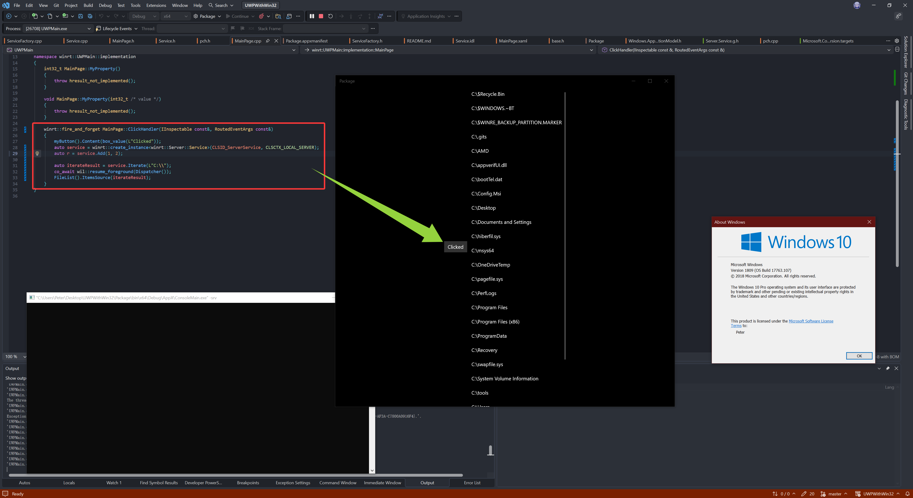

# UWP oop/winrt
This project act as a starting project template for a UWP bundled with a full-trust win32 server that accept COM calls. (So your UWP app can sort of jump out the limitation of a container, and it is allowed by Mirosoft store)

For UWP with Fulltrust win32, checkout `matser` branch.

## How
1. Create a new UWP C++/WinRT project
2. Create a new Windows Application Packaging Project
3. **Add reference to the UWP project**
4. Select the packaging project as the startup project, disable deployment of the UWP project (in configuration manager)
5. Right click the packaging project -> properties -> Debugging, select native debugging
6. Add a new C++ console application project
7. Modify the `Package.appxmanifest` file in the packaging project (see code)
8. Ensure the target platform version of the UWP project is the same as the packing project (I used 22621 in this project)
9. **Add a reference to the corresponding `Windows Desktop Extensions` in the UWP project** (so you have `Windows.ApplicationModel.FullTrustProcessLauncher` available)
--The above coming from UWP with Win32. Next are the OOP/winrt part--
10. Create `Service.idl` (just like your UWP/WinUI3 idl). But you now need to create the implementation file by yourself. See `Service.h` and `Service.cpp`
11. Create a `ServiceFactory.h/.cpp`, which are basically boilerplate for creating the `Service` class.
12. **In your UWP project, add reference to the `winmd` file that's generated in the console application project**
13. Generate a GUID that will be used in both `Package.appxmainfest`, `ConsoleMain/main.cpp` and your UWP app where you need to create the `Service` object.
14. In `Package.appxmanifest`, add a `com:Server` extension to your UWP Application entry. (See the file)
15. Now the packaging and the server parts are done. Now in your UWP app, whenever you need to create the `Service` object, you do it like so:
```cpp
auto service = winrt::create_instance<winrt::Server::Service>(CLSID_ServerService, CLSCTX_LOCAL_SERVER); //CLSID_ServerService is the guid you just created.
auto r = service.Add(1, 2);  //automatically launch server and calls into it. You do NOT need to do anything.
```

Demo:

I added the functionality to iterate any path (which normally is restricted unless user allowed the `broadFileSystem` capability) and return it as an array.

```idl
    runtimeclass Service
    {
        Service();
        Int32 Add(Int32 a, Int32 b);
        Windows.Foundation.Collections.IVector<Object> Iterate(String path);
    }
```

Result:

